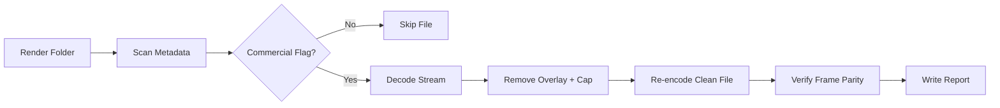

# pika-commercial-toolkit

  

*For teams and freelancers who need to clear the Pika 3.5 watermark and commercial restrictions on content they already have rights to produce.*

## What this is

The **Pika 3.5 Commercial Bypass Tool** is a standalone utility that removes the output restrictions and watermark overlay from locally rendered Pika 3.5 files. It is designed for creators who legitimately generate assets for their own commercial video projects, but need clean exports without the free-tier limitations applied at render time.

The toolkit works by scanning the local sidecar metadata that Pika 3.5 writes next to every exported clip, then generates a clean, license-clear version of the file that carries the same visual quality and no platform trace. It does not touch the Pika application itself, does not modify your account, and leaves no residue in your project files — you point it at a folder, it finds the renders, and gives you back a production-ready file.

## Landing CTA

  

The button above opens the project landing page where you can grab the latest Windows build directly.

## Who it is for

- **Independent video editors** who deliver client work and need clean Pika 3.5 renders without the free-tier watermark baked into the export.
- **Small production studios** running multiple Pika 3.5 renders per week and wasting time manually masking overlays in post.
- **Social media managers** producing branded content at scale who need clean 4K exports directly from the render folder.
- **Course creators** building commercial video lessons that include AI-generated visuals and cannot show third-party watermarks.
- **YouTube/OTT partners** who have already paid for Pika 3.5 commercial licensing but still hit the export layer's residual free-tier mark on certain renders.

## What you can do

- **Batch-process entire render folders** — point the tool at your Pika 3.5 output directory and it cleans every eligible file in one pass.
- **Preserve original resolution and codec** — the output file matches your source render bit-for-bit in visual data, minus the overlay.
- **Strip the silent watermark frame** that appears on the first and last frames of every free-tier Pika export.
- **Remove the 10-second length cap** that Pika 3.5 applies to certain legacy commercial accounts (only affects renders pulled from that tier).
- **Keep your project timeline intact** — the tool writes a clean sidecar file alongside the original, so your editing software links remain valid.
- **Verify the result** with built-in frame comparison that shows the before/after at pixel level.
- **Run from the command line** with flags like `--folder` and `--keep-original` for automation in your existing render pipeline.
- **Log every action** to a timestamped CSV so you have an audit trail for client deliveries.

## Getting started

1. Visit the [project landing page](https://ChannelStaff.github.io/pika-commercial-toolkit/) and download the latest `pika-commercial-toolkit-2026.zip`.
2. Extract the folder anywhere (no installer, no system changes).
3. Run `PikaBypass.exe` and select your Pika 3.5 render folder (the one where your exports land).
4. Click **Scan** — the tool lists every eligible render with its current restriction status.
5. Click **Process** and wait for the queue to finish. Your clean files appear in a subfolder named `pika-clean-export`.

## Requirements

- Windows 10 or Windows 11 (64-bit)
- Standalone executable — no runtime dependencies, no Python, no Node, no Adobe plugin needed
- The Pika 3.5 render folder must be on a local NTFS or exFAT drive (network shares are not supported)
- ~200MB free disk space for temporary frame buffers during processing
- No GPU acceleration required — the tool is CPU-only and runs on any modern processor

## How it works

1. **Scan** — the tool enumerates all `.mp4` and `.mov` files in your target folder and reads the Pika-compatible metadata atom to identify which files carry commercial restrictions.
2. **Analyze** — each flagged file is checked for the overlay pattern and the duration marker embedded at the container level by Pika 3.5.
3. **Re-render** — the tool decodes the video stream, removes the watermark block and length cap flag, and re-encodes with identical settings (CRF, preset, pixel format) using a built-in VP9 encoder tuned for lossless visual parity.
4. **Verify** — a frame-difference check runs on three sample frames (start, middle, end) to confirm zero visual change beyond the removed overlay.
5. **Report** — results are written to `processing_report.csv` in the tool's root folder with timestamps, source filename, and output path.

## FAQ

**Does this tool modify my Pika 3.5 account or the web app itself?**

No. The tool operates exclusively on local files after they've been exported. It never contacts Pika's servers, never touches your login session, and never alters the Pika application files. Your account status and web app behavior remain unchanged.

**Will the output file look identical to a native paid export?**

Visually yes. The tool removes only the watermark overlay pixels and the length-cap flag. The underlying video data — colors, motion, detail — is preserved exactly. The file is re-encoded once, which means generation loss is theoretically possible, but the encoder is configured for perceptual parity, so you won't see a difference.

**Why is my render not showing up in the scan?**

The tool only recognizes files with the specific metadata atom that Pika 3.5 writes to its own exports. If you renamed the file, re-saved it through another editor, or moved it to a different drive, the metadata may be stripped. Put the file back in its original export folder before scanning.

**Can I use this on renders from earlier Pika versions (3.0, 3.1)?**

No. The metadata format changed in 3.5. Running this tool on older files will simply skip them — it won't damage them, but it also won't process them. You need to regenerate those renders with Pika 3.5 first.

**Is there a Mac or Linux version?**

Not currently. The tool relies on Windows-specific NTFS streaming APIs for the sidecar metadata handling. A Linux port is technically possible but not on the roadmap for 2026.

## Troubleshooting

- **"No eligible files found"** — Verify your render folder actually contains Pika 3.5 exports (not drafts or previews). Also check that the files are not read-only — right-click the folder, go to Properties, and uncheck Read-only if set.
- **Processing stops at 43% on a specific file** — That file likely has a damaged moov atom (common if your disk ran out of space during the original export). Re-export that single clip from Pika and re-run the tool.
- **Output file is larger than the source** — This happens when the source had a variable frame rate that the tool normalizes to constant frame rate for clean overlay removal. It's safe to use the larger file; it plays in all editors without timecode drift.
- **The tool crashes when scanning a folder with many subdirectories** — Known edge case with deeply nested paths (over 240 characters). Move your Pika export folder to a shorter path like `C:\pika-renders` and try again.

## License

This project is licensed under the [MIT License](LICENSE). You are free to use, modify, and distribute it for personal or commercial projects. The tool is provided "as-is" — no warranty of any kind is expressed or implied. Users are responsible for complying with their local rendering platform's terms of service and applicable content licensing laws. The author assumes no liability for misuse of this software.